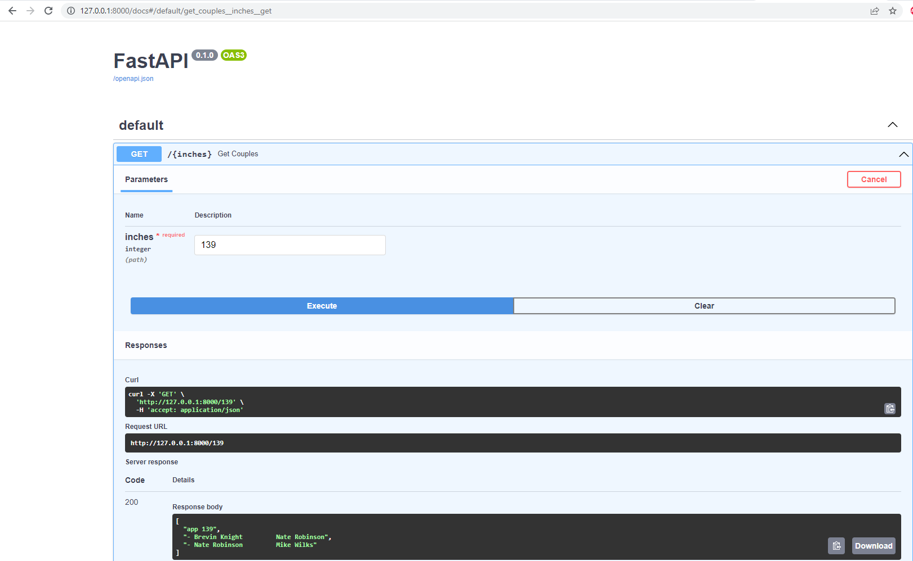
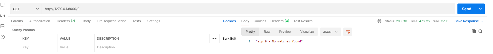

# Mach Eight Project

## Introduction
This API allows obtaining players in couples, where the search value on the API returns a list of all pairs of players whose height in inches adds up to the integer input to the application. If no matches are found, the application will print "No matches found"

## Technologies
python 3, fastAPI, uvicorn, pytest, more_itertools, request.

## Requirements
### In a virtual environment or python environment, set the PYTHON_PATH environment variable and later, execute the next command
pip install requirements.txt

## Unit Tests
### To generate unit testing coverage report, execute the next command
pytest -v --cov=. --cov-report=html

## Review Unit Testing Coverage
### in the root directory got to the file index.html in the folder htmlcov, and open it in your preferred browser
htmlcov/index.html

## Running the API
### execute the next command
uvicorn main:app --reload

## Testing the app
### open in the browser the next address and test it directly using swagger

http://127.0.0.1:8000/docs

### also, you can test the API using postman client, using get http method to the address and adding the value in inches to evaluate, like example

http://127.0.0.1:8000/'integer_inches_value'
 
http://127.0.0.1:8000/139
 
http://127.0.0.1:8000/0

